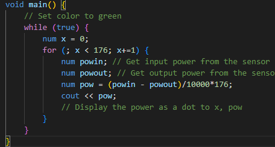

# Mindustry Compiler Syntax Highlighting

This is the syntax highlighting for the [Mindustry Compiler](https://github.com/ThatOneShortGuy/MindustryCompiler.git)



## Installation

It's not added to the VS Code Marketplace yet, so you have to install it manually. To do so, the extensions folder is located at `~/.vscode/extensions` on Linux and macOS, and at `%USERPROFILE%\.vscode\extensions` on Windows.
Then git clone this repository into the extensions folder.

```bash
git clone https://github.com/ThatOneShortGuy/mkxi-highlighting/tree/main
```

It should automatically be enabled, but if it's not, you can enable it by clicking on the language in the bottom right corner of VS Code and selecting `MKXI`.